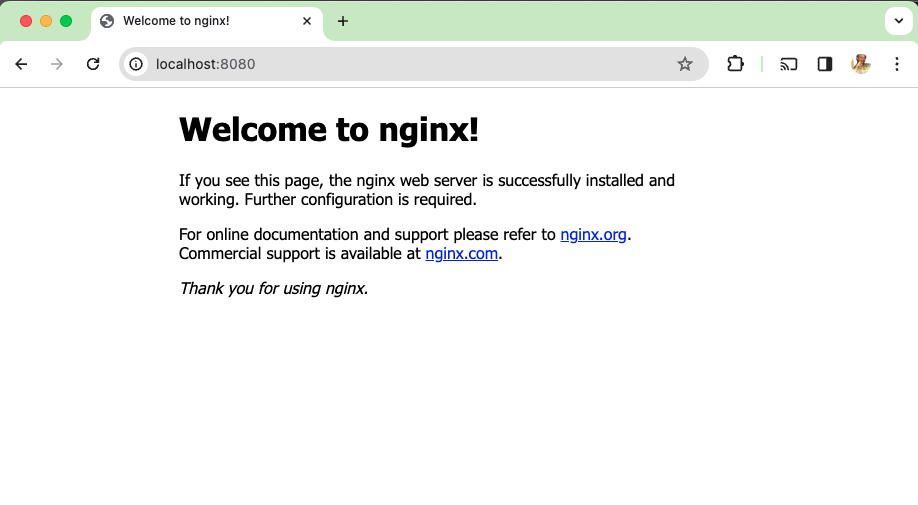
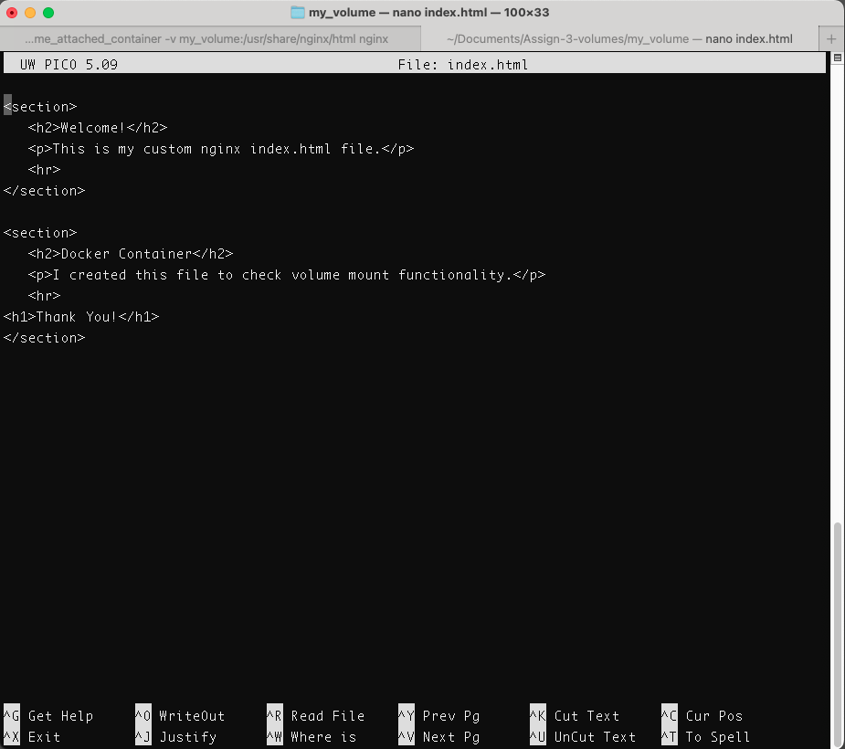
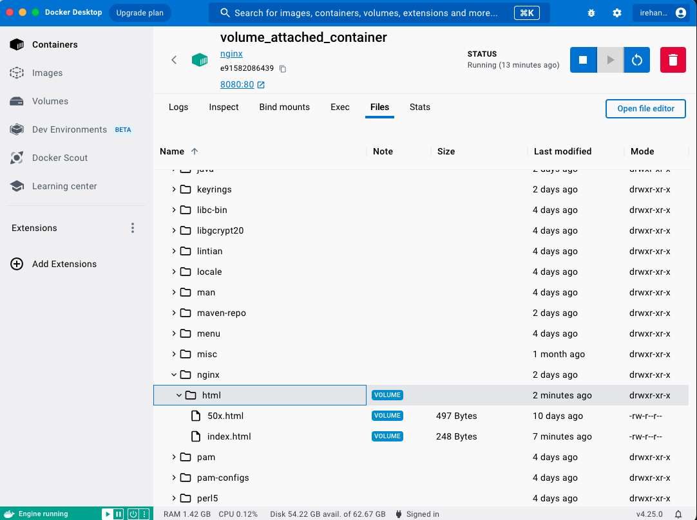
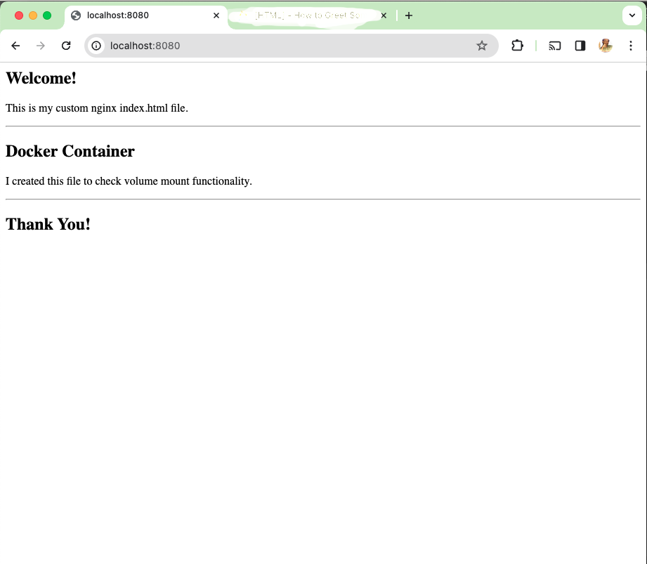
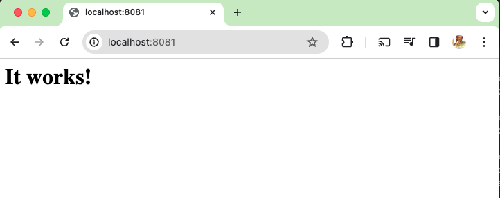
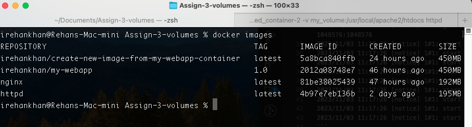
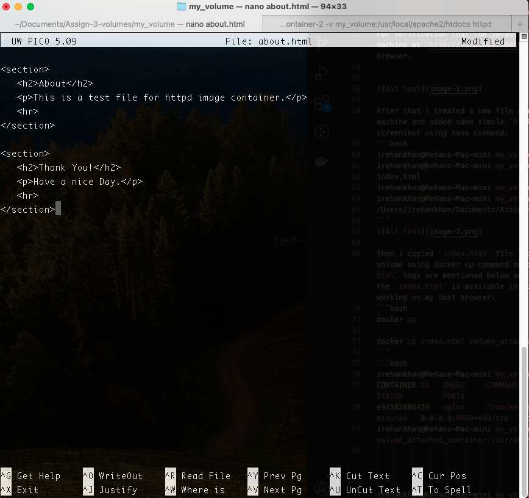
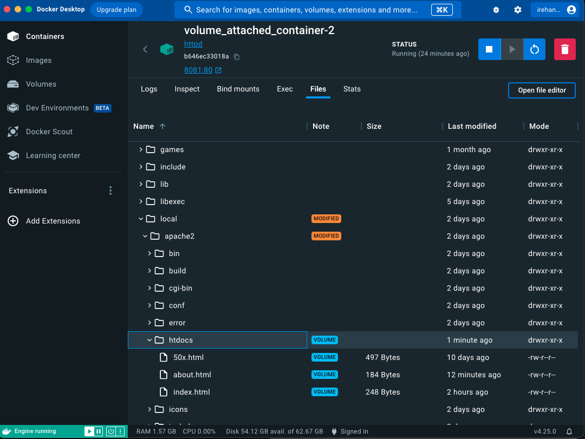
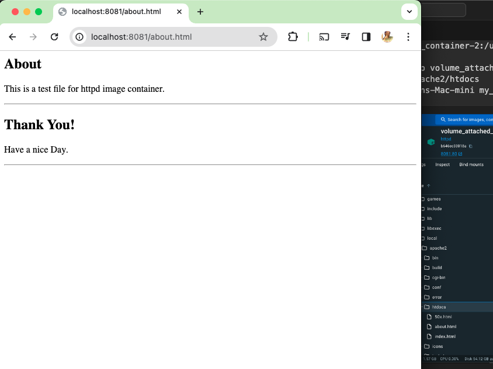
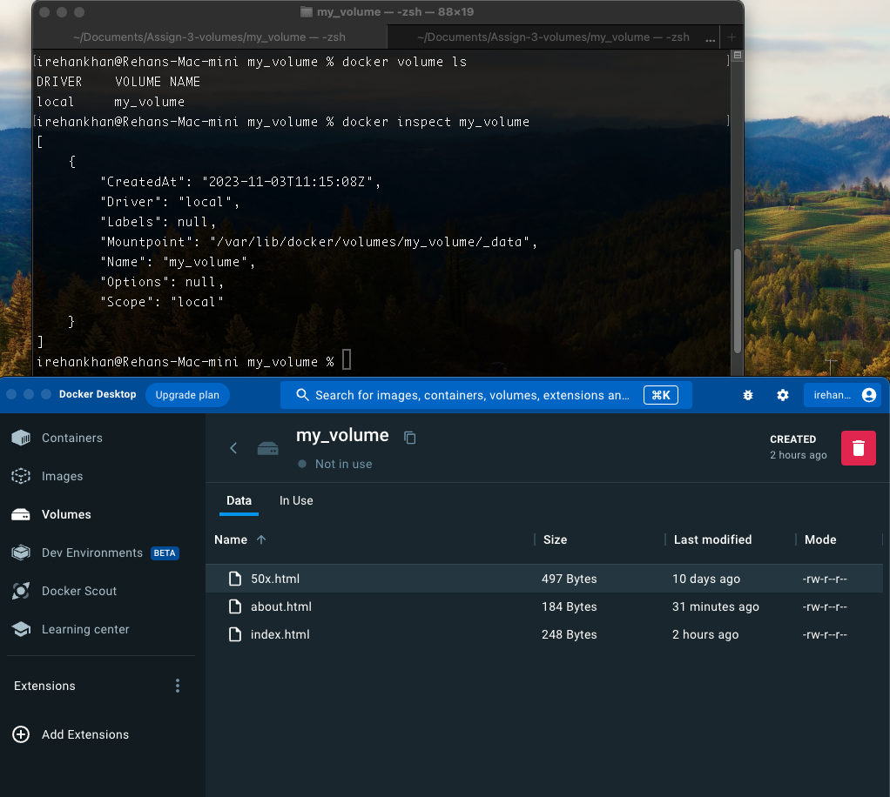

# Docker Volumes

## New Docker Volume
First i have created new docker volume named `my_volume` using below docker volume command then verified the created volume in below log.
```bash
docker volume create my_volume
```
```terminal
irehankhan@Rehans-Mac-mini Assign-3-volumes % docker volume create my_volume
my_volume
irehankhan@Rehans-Mac-mini Assign-3-volumes % docker volume ls
DRIVER    VOLUME NAME
local     my_volume
```
## New Docker Container `nginx`
Now i am creating new docker container using `nginx` image with custom port binding `8080:80` and binding `my_volume` to the container's `/usr/share/nginx/html` directory. You can check below log and command
```bash
docker run -p 8080:80 --name volume_attached_container -v my_volume:/usr/share/nginx/html nginx 
``` 
```terminal
irehankhan@Rehans-Mac-mini Assign-3-volumes % docker run -p 8080:80 --name volume_attached_container -v my_volume:/usr/share/nginx/html nginx 
/docker-entrypoint.sh: /docker-entrypoint.d/ is not empty, will attempt to perform configuration
/docker-entrypoint.sh: Looking for shell scripts in /docker-entrypoint.d/
/docker-entrypoint.sh: Launching /docker-entrypoint.d/10-listen-on-ipv6-by-default.sh
10-listen-on-ipv6-by-default.sh: info: Getting the checksum of /etc/nginx/conf.d/default.conf
10-listen-on-ipv6-by-default.sh: info: Enabled listen on IPv6 in /etc/nginx/conf.d/default.conf
/docker-entrypoint.sh: Sourcing /docker-entrypoint.d/15-local-resolvers.envsh
/docker-entrypoint.sh: Launching /docker-entrypoint.d/20-envsubst-on-templates.sh
/docker-entrypoint.sh: Launching /docker-entrypoint.d/30-tune-worker-processes.sh
/docker-entrypoint.sh: Configuration complete; ready for start up
2023/11/03 11:17:26 [notice] 1#1: using the "epoll" event method
2023/11/03 11:17:26 [notice] 1#1: nginx/1.25.3
2023/11/03 11:17:26 [notice] 1#1: built by gcc 12.2.0 (Debian 12.2.0-14) 
2023/11/03 11:17:26 [notice] 1#1: OS: Linux 6.4.16-linuxkit
2023/11/03 11:17:26 [notice] 1#1: getrlimit(RLIMIT_NOFILE): 1048576:1048576
2023/11/03 11:17:26 [notice] 1#1: start worker processes
2023/11/03 11:17:26 [notice] 1#1: start worker process 29
2023/11/03 11:17:26 [notice] 1#1: start worker process 30
2023/11/03 11:17:26 [notice] 1#1: start worker process 31
2023/11/03 11:17:26 [notice] 1#1: start worker process 32
2023/11/03 11:17:26 [notice] 1#1: start worker process 33
2023/11/03 11:17:26 [notice] 1#1: start worker process 34
2023/11/03 11:17:26 [notice] 1#1: start worker process 35
2023/11/03 11:17:26 [notice] 1#1: start worker process 36
```
```bash
irehankhan@Rehans-Mac-mini my_volume % docker images
REPOSITORY                                             TAG       IMAGE ID       CREATED        SIZE
irehankhan/create-new-image-from-my-webapp-container   latest    5a8bca840ffb   23 hours ago   450MB
irehankhan/my-webapp                                   1.0       2012a08748e7   46 hours ago   450MB
nginx                                                  latest    81be38025439   47 hours ago   192MB
irehankhan@Rehans-Mac-mini my_volume % 
```
For verification that the default `nginx` page is accessible on host machine at `http://localhost:8080` you can see below screenshot of my browser.




After that i created a new file named `index.html` on my local host machine and added some simple `html code` which is mentioned in below screenshot using nano command.
```bash
irehankhan@Rehans-Mac-mini my_volume % touch index.html
irehankhan@Rehans-Mac-mini my_volume % ls
index.html
irehankhan@Rehans-Mac-mini my_volume % nano index.html
irehankhan@Rehans-Mac-mini my_volume % pwd
/Users/irehankhan/Documents/Assign-3-volumes/my_volume
```


Then i copied `index.html` file from host machine to `my_volume` volume using docker cp command on container path `/usr/share/nginx/html` logs are mentioned below and you can see below screenshots that the `index.html` is available in container and copied`index.html` is working on my host browser.
```bash
docker cp

docker cp index.html volume_attached_container:/usr/share/nginx/html
```
```bash
irehankhan@Rehans-Mac-mini my_volume % docker ps            
CONTAINER ID   IMAGE     COMMAND                  CREATED         STATUS         PORTS                  NAMES
e91582086439   nginx     "/docker-entrypoint.…"   9 minutes ago   Up 9 minutes   0.0.0.0:8080->80/tcp   volume_attached_container
irehankhan@Rehans-Mac-mini my_volume % docker cp index.html volume_attached_container:/usr/share/nginx/html
                                             Successfully copied 2.05kB to volume_attached_container:/usr/share/nginx/html
irehankhan@Rehans-Mac-mini my_volume % 
```



At last i have stopped the `nginx` container `e91582086439` and removed it you can see in below logs.
```terminal
irehankhan@Rehans-Mac-mini my_volume % docker ps
CONTAINER ID   IMAGE     COMMAND                  CREATED          STATUS          PORTS                  NAMES
e91582086439   nginx     "/docker-entrypoint.…"   16 minutes ago   Up 16 minutes   0.0.0.0:8080->80/tcp   volume_attached_container
irehankhan@Rehans-Mac-mini my_volume % docker stop e91582086439
e91582086439
irehankhan@Rehans-Mac-mini my_volume % docker ps -a
CONTAINER ID   IMAGE                                                  COMMAND                  CREATED          STATUS                      PORTS                    NAMES
e91582086439   nginx                                                  "/docker-entrypoint.…"   16 minutes ago   Exited (0) 10 seconds ago                            volume_attached_container
577036867db0   irehankhan/my-webapp:1.0                               "/bin/sh -c 'FLASK_A…"   17 hours ago     Exited (137) 17 hours ago                            my-test-cont
377d38636ffd   irehankhan/my-webapp:1.0                               "/bin/sh -c 'FLASK_A…"   19 hours ago     Exited (255) 4 hours ago    0.0.0.0:2029->5000/tcp   my-test-container-1
c2363d066419   irehankhan/create-new-image-from-my-webapp-container   "/bin/sh -c 'FLASK_A…"   22 hours ago     Exited (137) 20 hours ago                            my-webapp-container-t
8faea85eed1e   irehankhan/my-webapp:1.0                               "/bin/sh -c 'FLASK_A…"   23 hours ago     Exited (255) 4 hours ago    0.0.0.0:2024->5000/tcp   my-webapp-contanier4
4b8492d234fd   irehankhan/my-webapp:1.0                               "/bin/sh -c 'FLASK_A…"   25 hours ago     Exited (255) 4 hours ago    0.0.0.0:2022->5000/tcp   my-webapp-container-renamed
30f38eba4c58   irehankhan/my-webapp:1.0                               "/bin/sh -c 'FLASK_A…"   25 hours ago     Exited (255) 4 hours ago    0.0.0.0:2020->5000/tcp   my-webapp-container
irehankhan@Rehans-Mac-mini my_volume % docker rm e91582086439
e91582086439
irehankhan@Rehans-Mac-mini my_volume % 
```
## New Docker Container `httpd`
First i am creating new docker container using `httpd` image with custom port binding `8081:80` to verify that httpd default page is accessible on my local host machine at `http://localhost:8081`
```bash
irehankhan@Rehans-Mac-mini my_volume % docker run -p 8081:80 --name volume_attached_container-2 httpd

AH00558: httpd: Could not reliably determine the server's fully qualified domain name, using 172.17.0.2. Set the 'ServerName' directive globally to suppress this message
AH00558: httpd: Could not reliably determine the server's fully qualified domain name, using 172.17.0.2. Set the 'ServerName' directive globally to suppress this message
[Fri Nov 03 12:50:49.152144 2023] [mpm_event:notice] [pid 1:tid 281473858060320] AH00489: Apache/2.4.58 (Unix) configured -- resuming normal operations
[Fri Nov 03 12:50:49.152203 2023] [core:notice] [pid 1:tid 281473858060320] AH00094: Command line: 'httpd -D FOREGROUND'
192.168.65.1 - - [03/Nov/2023:12:51:03 +0000] "GET / HTTP/1.1" 304 -
192.168.65.1 - - [03/Nov/2023:12:51:55 +0000] "-" 408 -
```


Now i am creating new docker container using `httpd` image with custom port binding `8081:80` and binding `my_volume` to the container's `/usr/local/apache2/htdocs` directory. You can check below log and command
```bash
docker run -p 8081:80 --name volume_attached_container-2 -v my_volume:/usr/local/apache2/htdocs httpd 
``` 
```bash
irehankhan@Rehans-Mac-mini my_volume % docker run -p 8081:80 --name volume_attached_container-2 -v my_volume:/usr/local/apache2/htdocs httpd
AH00558: httpd: Could not reliably determine the server's fully qualified domain name, using 172.17.0.2. Set the 'ServerName' directive globally to suppress this message
AH00558: httpd: Could not reliably determine the server's fully qualified domain name, using 172.17.0.2. Set the 'ServerName' directive globally to suppress this message
[Fri Nov 03 12:58:56.349281 2023] [mpm_event:notice] [pid 1:tid 281473716830240] AH00489: Apache/2.4.58 (Unix) configured -- resuming normal operations
[Fri Nov 03 12:58:56.349354 2023] [core:notice] [pid 1:tid 281473716830240] AH00094: Command line: 'httpd -D FOREGROUND'
```


After that i created a new file named `about.html` on my local host machine and added some simple `html code` which is mentioned in below screenshot using nano command.
```bash
irehankhan@Rehans-Mac-mini my_volume % ls
index.html
irehankhan@Rehans-Mac-mini my_volume % touch about.html
irehankhan@Rehans-Mac-mini my_volume % nano about.html
irehankhan@Rehans-Mac-mini my_volume % ls
about.html	index.html

```


Then i copied `about.html` file from host machine to `my_volume` volume using docker cp command on container path `/usr/local/apache2/htdocs` logs are mentioned below and you can see below screenshots that the `about.html` is available in container and copied`about.html` is working on my host browser.
```bash
docker cp

docker cp about.html volume_attached_container-2:/usr/local/apache2/htdocs
```
```bash
irehankhan@Rehans-Mac-mini my_volume % docker ps
CONTAINER ID   IMAGE     COMMAND              CREATED          STATUS          PORTS                  NAMES
b646ec33018a   httpd     "httpd-foreground"   21 minutes ago   Up 21 minutes   0.0.0.0:8081->80/tcp   volume_attached_container-2
irehankhan@Rehans-Mac-mini my_volume % docker cp about.html volume_attached_container-2:/usr/local/apache2/htdocs
                                             Successfully copied 2.05kB to volume_attached_container-2:/usr/local/apache2/htdocs
irehankhan@Rehans-Mac-mini my_volume % 
```



At last i have stopped the `httpd` container `b646ec33018a` and removed it you can see in below logs.

```bash
irehankhan@Rehans-Mac-mini my_volume % docker ps
CONTAINER ID   IMAGE     COMMAND              CREATED          STATUS          PORTS                  NAMES
b646ec33018a   httpd     "httpd-foreground"   27 minutes ago   Up 27 minutes   0.0.0.0:8081->80/tcp   volume_attached_container-2
irehankhan@Rehans-Mac-mini my_volume % docker stop b646ec33018a
b646ec33018a
irehankhan@Rehans-Mac-mini my_volume % docker ps -a
CONTAINER ID   IMAGE                                                  COMMAND                  CREATED          STATUS                      PORTS                    NAMES
b646ec33018a   httpd                                                  "httpd-foreground"       28 minutes ago   Exited (0) 4 seconds ago                             volume_attached_container-2
577036867db0   irehankhan/my-webapp:1.0                               "/bin/sh -c 'FLASK_A…"   19 hours ago     Exited (137) 19 hours ago                            my-test-cont
377d38636ffd   irehankhan/my-webapp:1.0                               "/bin/sh -c 'FLASK_A…"   20 hours ago     Exited (255) 6 hours ago    0.0.0.0:2029->5000/tcp   my-test-container-1
c2363d066419   irehankhan/create-new-image-from-my-webapp-container   "/bin/sh -c 'FLASK_A…"   24 hours ago     Exited (137) 22 hours ago                            my-webapp-container-t
8faea85eed1e   irehankhan/my-webapp:1.0                               "/bin/sh -c 'FLASK_A…"   25 hours ago     Exited (255) 6 hours ago    0.0.0.0:2024->5000/tcp   my-webapp-contanier4
4b8492d234fd   irehankhan/my-webapp:1.0                               "/bin/sh -c 'FLASK_A…"   27 hours ago     Exited (255) 6 hours ago    0.0.0.0:2022->5000/tcp   my-webapp-container-renamed
30f38eba4c58   irehankhan/my-webapp:1.0                               "/bin/sh -c 'FLASK_A…"   27 hours ago     Exited (255) 6 hours ago    0.0.0.0:2020->5000/tcp   my-webapp-container
irehankhan@Rehans-Mac-mini my_volume % docker rm b646ec33018a  
b646ec33018a
irehankhan@Rehans-Mac-mini my_volume % docker ps -a
CONTAINER ID   IMAGE                                                  COMMAND                  CREATED        STATUS                      PORTS                    NAMES
577036867db0   irehankhan/my-webapp:1.0                               "/bin/sh -c 'FLASK_A…"   19 hours ago   Exited (137) 19 hours ago                            my-test-cont
377d38636ffd   irehankhan/my-webapp:1.0                               "/bin/sh -c 'FLASK_A…"   20 hours ago   Exited (255) 6 hours ago    0.0.0.0:2029->5000/tcp   my-test-container-1
c2363d066419   irehankhan/create-new-image-from-my-webapp-container   "/bin/sh -c 'FLASK_A…"   24 hours ago   Exited (137) 22 hours ago                            my-webapp-container-t
8faea85eed1e   irehankhan/my-webapp:1.0                               "/bin/sh -c 'FLASK_A…"   25 hours ago   Exited (255) 6 hours ago    0.0.0.0:2024->5000/tcp   my-webapp-contanier4
4b8492d234fd   irehankhan/my-webapp:1.0                               "/bin/sh -c 'FLASK_A…"   27 hours ago   Exited (255) 6 hours ago    0.0.0.0:2022->5000/tcp   my-webapp-container-renamed
30f38eba4c58   irehankhan/my-webapp:1.0                               "/bin/sh -c 'FLASK_A…"   27 hours ago   Exited (255) 6 hours ago    0.0.0.0:2020->5000/tcp   my-webapp-container
irehankhan@Rehans-Mac-mini my_volume % 
```
## Verify Files Availability in `my_volume`
After stopping and removing `nginx` & `httpd` containers i verified that `my_volume` and its files are available you can see in below logs and screenshot.
```bash
irehankhan@Rehans-Mac-mini my_volume % docker volume ls
DRIVER    VOLUME NAME
local     my_volume
irehankhan@Rehans-Mac-mini my_volume % docker inspect my_volume
[
    {
        "CreatedAt": "2023-11-03T11:15:08Z",
        "Driver": "local",
        "Labels": null,
        "Mountpoint": "/var/lib/docker/volumes/my_volume/_data",
        "Name": "my_volume",
        "Options": null,
        "Scope": "local"
    }
]
irehankhan@Rehans-Mac-mini my_volume % 
```


For more verification i cerated a new docker container using `busybox` tiny image and binded `my_volume` to the container's `/opt` directory. You can check below logs both `my_volume` volume and inside files are available.<br>
Commands used
```bash
To pull busybox from docker hub

docker pull busybox

To execute commands in busybox shell for verification of files in `my_volume` volume by binding to container path `/opt`

docker run -it --name busybox_container -v my_volume:/opt busybox sh
```
Also for file data/txt verification i used cat command to view files text inside.
```bash
irehankhan@Rehans-Mac-mini my_volume % docker pull busybox
Using default tag: latest
latest: Pulling from library/busybox
8a0af25e8c2e: Pull complete 
Digest: sha256:3fbc632167424a6d997e74f52b878d7cc478225cffac6bc977eedfe51c7f4e79
Status: Downloaded newer image for busybox:latest
docker.io/library/busybox:latest

What's Next?
  View a summary of image vulnerabilities and recommendations → docker scout quickview busybox
irehankhan@Rehans-Mac-mini my_volume % docker run -it --name busybox_container -v my_volume:/opt busybox bash
docker: Error response from daemon: failed to create task for container: failed to create shim task: OCI runtime create failed: runc create failed: unable to start container process: exec: "bash": executable file not found in $PATH: unknown.
irehankhan@Rehans-Mac-mini my_volume % docker run -it --name busybox_container -v my_volume:/opt busybox sh  
docker: Error response from daemon: Conflict. The container name "/busybox_container" is already in use by container "3a2da3c206b127695f8e8178945d5ab5ad2c3c7dbd54504fdd03cf3c25140c21". You have to remove (or rename) that container to be able to reuse that name.
See 'docker run --help'.
irehankhan@Rehans-Mac-mini my_volume % docker run -it --name busybox_container -v my_volume:/opt busybox sh
/ # cd /opt
/opt # ls
50x.html    about.html  index.html
/opt # pwd
/opt
/opt # cat index.html
<section>
   <h2>Welcome!</h2>
   <p>This is my custom nginx index.html file.</p>
   <hr>
</section>

<section>
   <h2>Docker Container</h2>
   <p>I created this file to check volume mount functionality.</p>
   <hr>
<h1>Thank You!</h1>
</section> 
/opt # cat about.html 
<section>
   <h2>About</h2>
   <p>This is a test file for httpd image container.</p>
   <hr>
</section>

<section>
   <h2>Thank You!</h2>
   <p>Have a nice Day.</p>
   <hr>
</section>
/opt # 
```
<h1></h1>
<h1 style="text-align: center;">Thank You!</h1>
